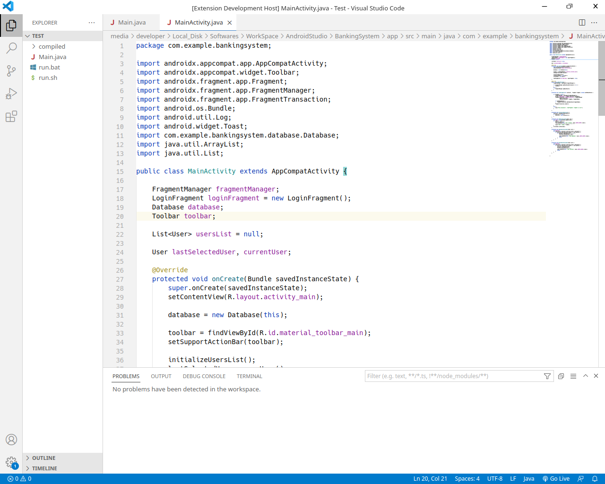

# Android Studio themes

Android Studio color theme contains two basic themes, Darcula and Intellij light.

## Supported Languages
* Java - XML
* C++
* HTML - CSS - JavaScript

## Applying theme

### To apply theme:
* Ctrl+Shift+P -> Preferences: Color Theme -> Darcula (Android Studio)
* Ctrl+Shift+P -> Preferences: Color Theme -> Intellij light (Android Studio)

## Preview

* Darcula

* Intellij light

**Enjoy!**
