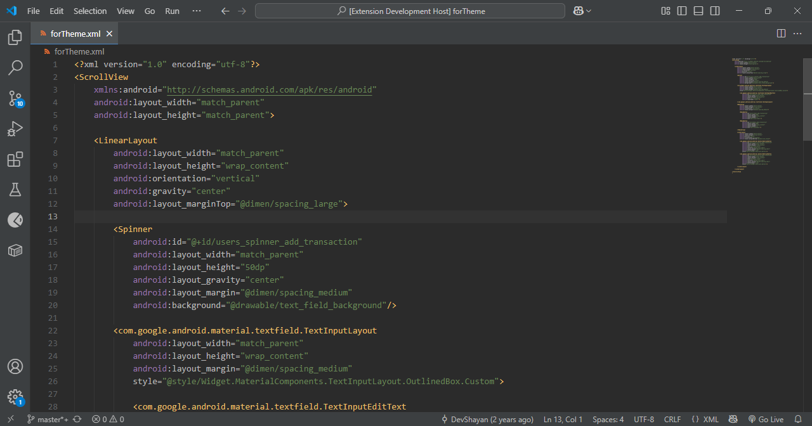
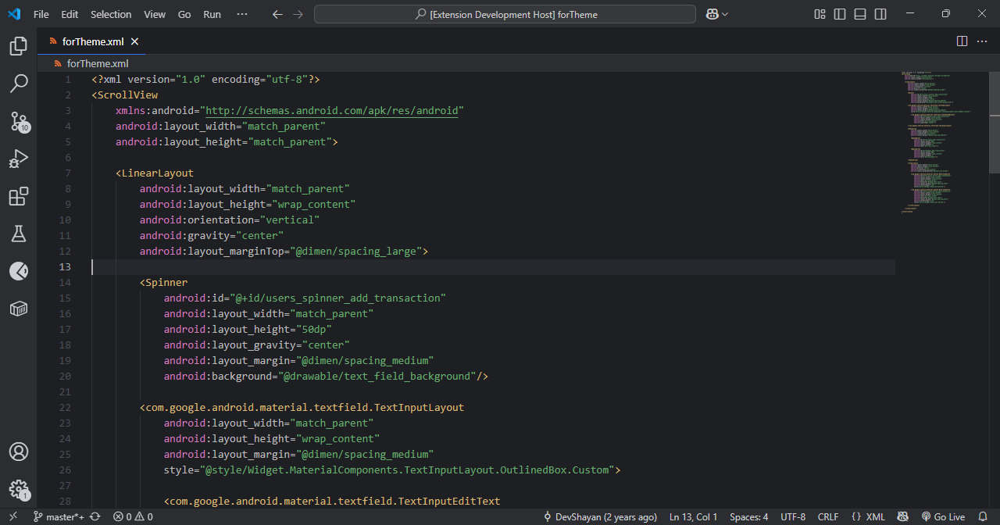
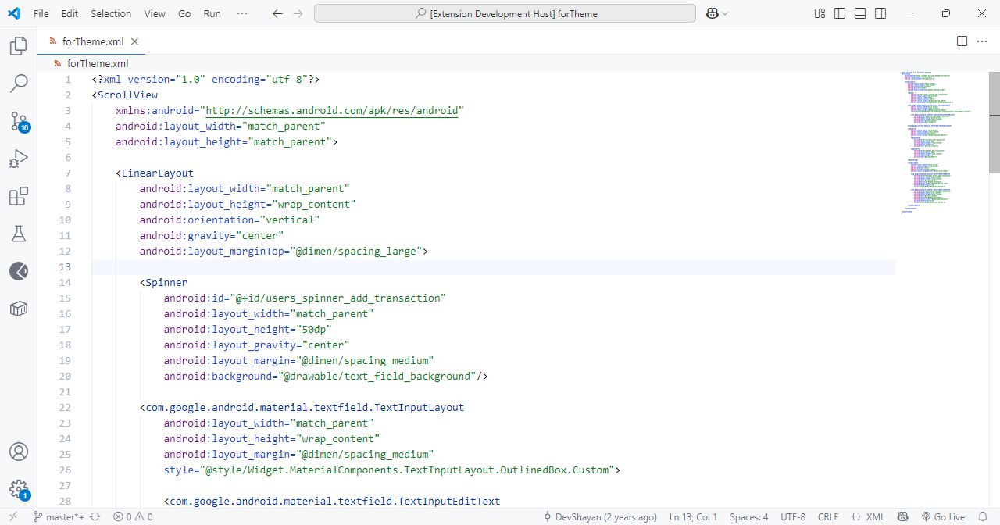

# Android Studio Default themes

Android Studio color theme contains three basic themes, Darcula, Light and Dark.

#### [GitHub Repository](https://github.com/DevShayan/android-studio-color-theme)&nbsp;&nbsp;|&nbsp;&nbsp;[Report an issue](https://github.com/DevShayan/android-studio-color-theme/issues)

## Applying theme

### To apply theme:
* Ctrl+Shift+P -> Preferences: Color Theme -> Darcula - Android Studio
* Ctrl+Shift+P -> Preferences: Color Theme -> Dark - Android Studio
* Ctrl+Shift+P -> Preferences: Color Theme -> Light - Android Studio

## Preview

* Darcula

* Dark

* Light

**Enjoy!**
